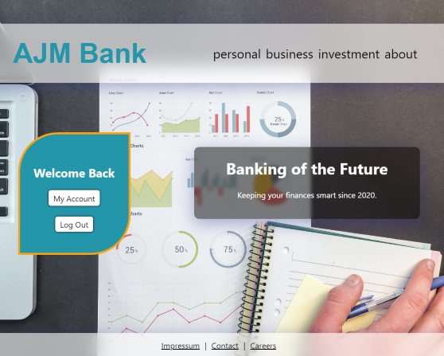

# AJM Banking

**Work in Progress**

## Description

AJM Banking is a new bank with a simple message: let's make things modern. This new bank provides an unconventional banking platform where you can indiscriminately make yourself wealthy by simply adding as much money to your account as you want, but you can also zero out your account when you feel like the money is going to your head. Welcome to the future!

## Technical Notes

- Express server on the backend for all requests to MongoDB Atlas database.
- Serves the static build of the `create-react-app` `index.html` file.
- Routing achieved on the front-end using `react-router-dom` package.
- Styling achieved with `styled-components` package.

## To-do

- Change layout to Grid and improve mobile experience
- Add personal/business/investment page mockups
- Add 'Latest 5 transactions' and add transaction list to MongoDB collection
- Add bank account name to personalise welcome message
